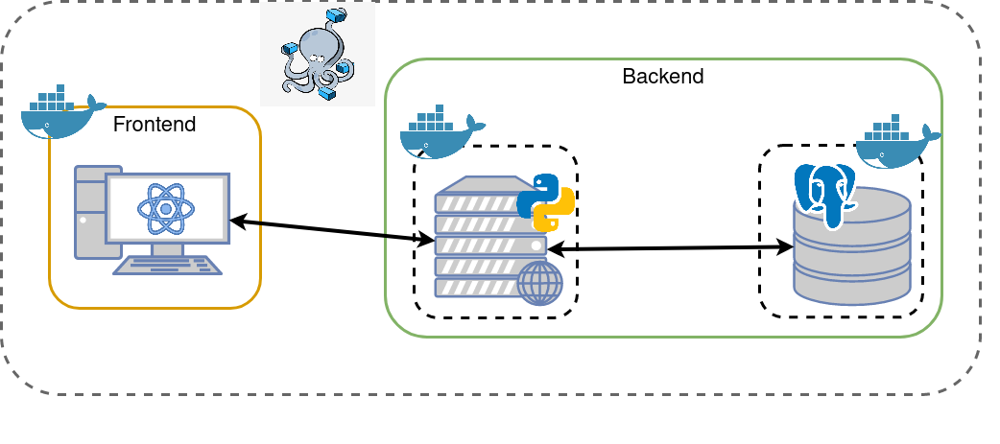

# To-Do Web App - Solution Documentation

## Table of Contents

1. [Solution Overview](#solution-overview)
2. [Architecture](#architecture)
3. [Technical Overview](#technical-overview)
4. [Setup Instructions](#setup-instructions)

## Solution Overview

The following were the product requirements:

-   As a user, I want to use The App to track a list of things I ought to do.
-   As a user, I shall be able to create/read/update/delete items in list of To-Do items.
-   As a user, I shall be able to mark a To-Do item as done, with one single user interaction (e.g. a click) from the entire list.
-   As a user, when I reopen The App on my browser, I shall see all the data I might have left from previous accesses.
-   As a user, I should be able to clear all my data.

With the intent of tackling each and every one of the aforementioned requirements, the solution developed consists of a client-server architecture.

The following is a list of the features that were implemented:

-   Login and SignUp screen. Since this wasn't a requirement, the authentication here is barely null. The choice of implementing these screens were just to mimic a real world application where a user must enter a set of credentials to access their data. And besides, it was easier to manage the tasks if an association between user and task existed :)
-   Dashboard screen. In this screen the user has access to their collection of tasks. A colletion is just a simple task grouping mechanism. Instead of having the tasks all over the place, we have the ability to categorize them. Obviously, CRUD operations in regards to collections were also implemented.
-   Collection screen. This is the core feature of the assignment, where a user can create/delete/edit/read their tasks.
-   404 and Empty State screens. The first screen is used whenever the user makes some typo to the URL, while the second one is used both in Dashboard and Collection screens to indicate that the user does not have any data yet.
-   SUSE's color palette and typography. I tried do develop a solution that would fit perfectly within SUSE's brand design styles and guidelines.

## Architecture



## Technical Overview

Note that all the tools and frameworks used are open-source :)

### DevOps

Technologies used:

-   docker for evironment isolation
-   docker-compose to run the multiple docker services (see Architecture image)

### Frontend

Technologies used:

-   React for building the user interface.
-   Redux for state management. Normally, given the simplicity of the task at hand, I would just use React `useState`. However, Redux is a tool that I wanted to learn ever since I started developing with React so I took the oportunity to learn it while I developed this assignment.
-   Material UI as a repository of React components ready to be used.
-   React Router to create the routing between the webapp's pages.
-   Proptypes to add a type layer to all components of the webapp and ease their development as well as their debugging.

### Backend

Technologies used:

-   FastAPI. I haven't that much of experience with API design and implementation, therefore I chose the framework that would be easier for me to develop a stable API with.
-   PostgreSQL. I have more experience with relational databases than with non-relational ones, thus the DB choice was simple: PostgreSQL or MySQL. I chose PostgreSQL because I'm more used to it.
-   SQLAlchemy. This tool enabled me to write SQL queries within the API's python code which eased the DB accesses.

## Setup Instructions

To run the app you must first clone this repository and have the following dependencies installed:

-   docker: https://docs.docker.com/engine/install/ubuntu/
-   docker-compose: https://docs.docker.com/compose/install/

After cloning the repository, go to the source of the project and simply run:

```
docker-compose up --build
```

When all services are up and running (`frontend`, `api` and `postgres`), open a web browser and access the following url:

```
localhost:8080
```

There is already a test account that you can use, however I recommend you to create a new user so that you can have the most out of this web application - although you can do both :)

```
username: test
```
